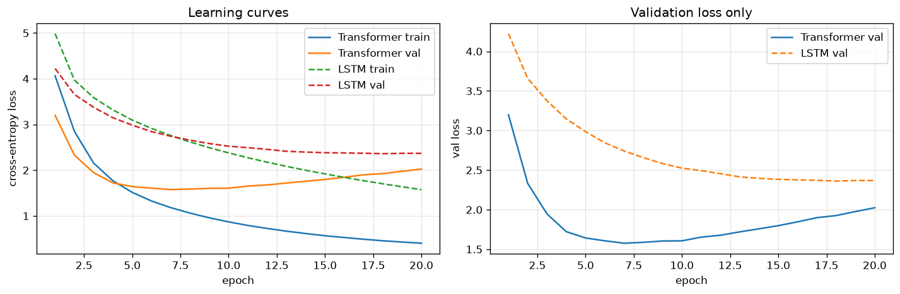
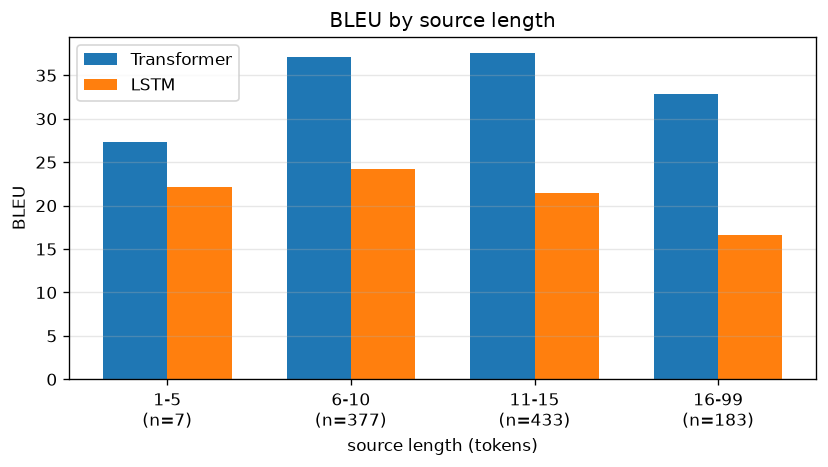

# Transformer vs LSTM Seq2Seq

Multi30k 独→英の翻訳タスクで、Transformer と素の LSTM Encoder-Decoder (Attention 無し) を同条件で訓練し比較した。

## 実験設定

- データ: Multi30k 独→英 (train 29,000 / val 1,014 / test 1,000)
- 語彙: 単語単位、min_freq=2
- 訓練: 20 epoch、batch 64、Adam lr=5e-4、gradient clipping 1.0
- 環境: Colab T4 GPU
- 評価: sacrebleu BLEU、Greedy Decode

## モデル

- Transformer: d_model=256、num_heads=8、d_ff=1024、num_layers=3
- LSTM: embed_dim=256、hidden_dim=320、num_layers=3 (パラメータ数を Transformer に揃えた)

## 結果

| モデル | パラメータ数 | 訓練時間 | 最終 train loss | 最終 val loss | BLEU |
|---|---|---|---|---|---|
| Transformer | 10,574,090 | 388s | 0.403 | 2.024 | **36.08** |
| LSTM | 10,187,658 | 315s | 1.574 | 2.368 | 20.83 |

Transformer の BLEU は LSTM の約 1.7 倍。

### 学習曲線

### 文長別 BLEU

| source length | n | Transformer BLEU | LSTM BLEU | 差 |
|---|---|---|---|---|
| 1〜5 | 7 | 27.27 | 22.19 | +5.08 |
| 6〜10 | 377 | 37.05 | 24.19 | +12.86 |
| 11〜15 | 433 | 37.54 | 21.42 | +16.12 |
| 16+ | 183 | 32.86 | 16.59 | +16.27 |

文長が伸びるほど Transformer の優位が拡大している。LSTM は長距離依存の処理が弱く、source の長さが増えると性能が落ちる。Transformer は系列長に対してロバスト。

## 訳例 (test セットから抜粋)

**sample 0**
- REF : a man in an orange hat starring at something .
- TRA : a man in an orange hat `<unk>` something .
- LSTM: a man in an orange hat is cooking something .

**sample 1**
- REF : a boston terrier is running on lush green grass in front of a white fence .
- TRA : a boston `<unk>` dog runs over deep green grass in front of a white fence .
- LSTM: a `<unk>` is running on the grass while a large boy in gray .

**sample 3**
- REF : five people wearing winter jackets and helmets stand in the snow , with `<unk>` in the background .
- TRA : five people in winter jackets and helmets are standing in the snow with peaks in the background .
- LSTM: five people wearing helmets , wearing hats , standing in the snow with the number trees in the background .

**sample 4**
- REF : people are fixing the roof of a house .
- TRA : people repair the roof of a house .
- LSTM: people are riding on the side of a building .

## 考察

- BLEU で 15 ポイント以上の差は、Multi30k のような小規模翻訳でも Transformer の優位性が明確に出ることを示している
- 文長別 BLEU で「source が長くなるほど差が広がる」結果は、Transformer の長距離依存処理の優位性を直接示す
- 訓練時間は LSTM の方が短い (315s vs 388s) が、性能差を考えれば Transformer の方がコストパフォーマンスが高い
- Transformer は train loss が低く val loss との乖離が大きい (0.40 vs 2.02) ので過学習気味。dropout や label smoothing を強化する余地あり
